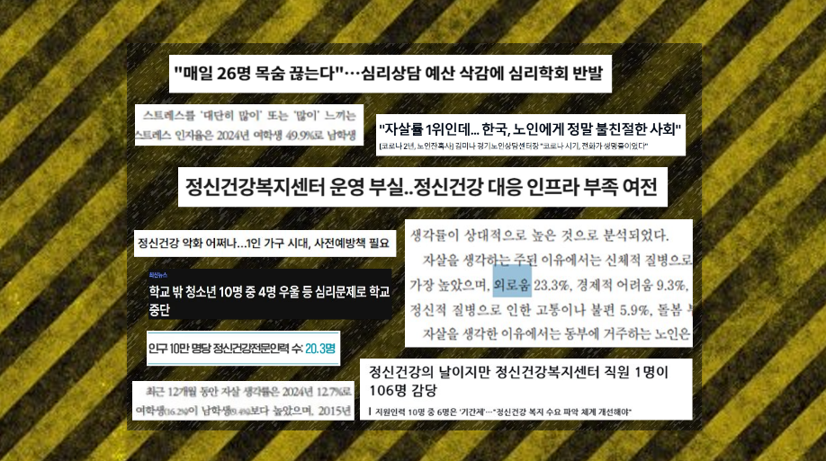
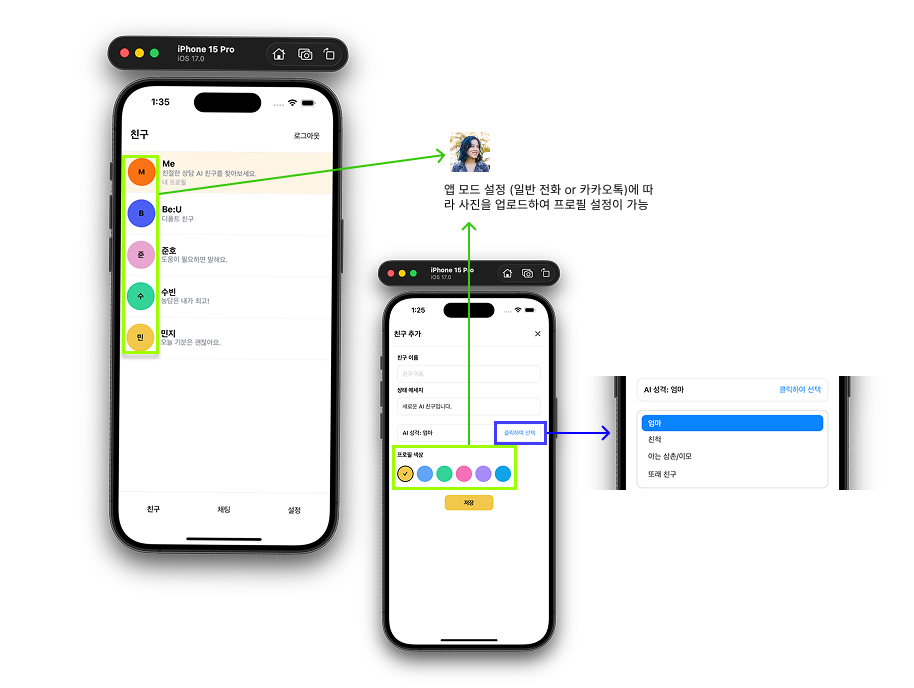
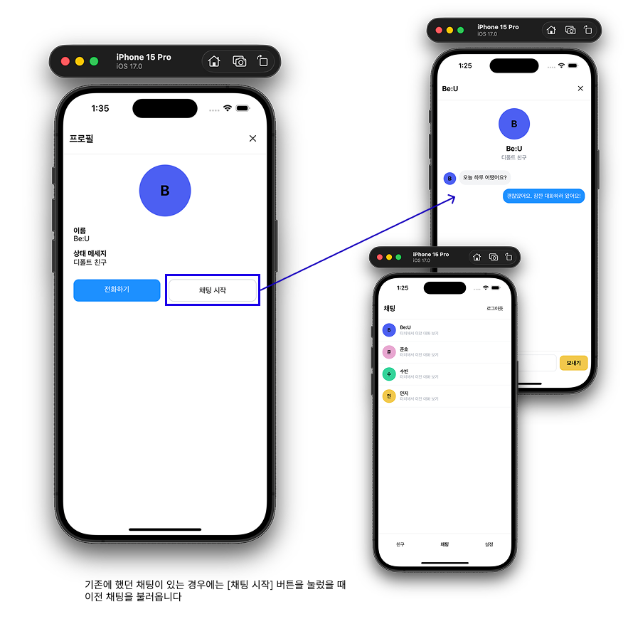
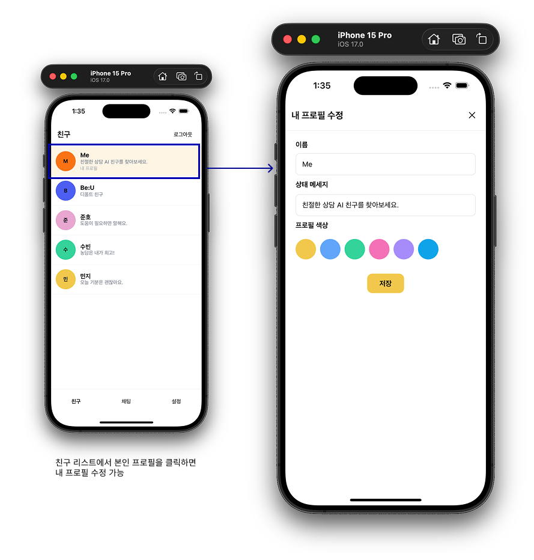
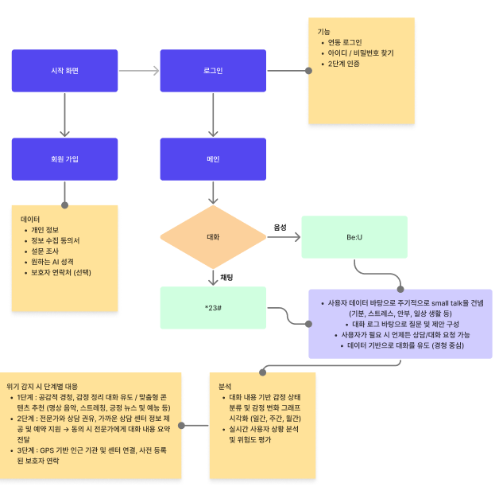

# 🌿 **숨터 (soom_teo)**
### **AI 기반 정서·심리 케어 플랫폼** - **팀 유성구 해바라기반**

<p align="center">
	
</p>

</br>

## 📌 **서비스 개요 (소개)**

**숨터(soom_teo)** 는
**사회적 약자(청소년·노인)의 정서적 불안, 외로움, 스트레스, 우울감**을 완화하기 위해 설계된
**AI 기반 비대면 심리·정서 케어 플랫폼**입니다.

사용자는 앱을 통해

* **AI 챗봇 상담(Be:U)**
* **AI 음성 상담(\*23#)**
* **감정 트래킹 및 리포트**
* **위기 단계 자동 감지 및 공공기관 연계**

를 제공받습니다.

숨터의 목표는
“누구나, 언제든지, 부담 없이 감정을 털어놓을 수 있는 안전한 공간 제공”이며
상담 접근성이 낮은 청소년/노인에게 **‘심리 완충 장치’** 역할을 수행합니다.

---

# ✨ **로고**

<p align="center">
  
</p>


---

# 🧠 **서비스 핵심 내용**

## 1️⃣ **왜 필요한가? (문제 배경)**

### ● 청소년

2024년 보건복지부 조사

* **30% 이상** 최근 1년간 우울감 경험k
* **10명 중 8명**: “도움을 받고 싶었지만 받지 못함”
  → 이유: 눈치, 시선 부담, 비밀보장 불안, 상담 접근성 낮음

### ● 노인

통계청·보건사회연구원 조사

* 독거노인 비율 **38.5%**
* 노인의 **42%** “대화할 사람이 거의 없다”
* IT 활용 어려움 + 이동성 문제 → 상담 접근 불가
  → 우울감, 고립, 고독사 위험 증가

### ● 기존 상담 서비스의 한계

* 청소년: 위클래스·학교 상담 = 비밀보장 불안
* 청소년·성인: 1388 & 전문센터 = 대기·운영시간 제한
* 노인: 방문 상담 위주의 낮은 접근성
* 기존 AI 챗봇: 위험 발화 대응 실패 사례 존재

➡ **숨터는 기존의 공백을 메우기 위해 “즉각적·익명·상시·맞춤형” 정서 케어 플랫폼으로 설계됨.**

---


# 2️⃣ **서비스 구조 및 주요 기능**

### 💬 **Be:U — AI 기반 심리 상담**

> “가장 익숙한 대화 방식으로, 가장 쉽게 마음을 열 수 있는 심리 케어”

**주요 특징**

* **메신저 기반 UI** — 부담 없는 상담 경험
* **감정 분석 기반 질문·응답** — 사용자 감정 흐름에 맞는 대화
* **부정 감정 탐지 → 즉각 공감·안정화 메시지**
* **위험도 평가 시스템 적용** — 단계별 대응 프로세스 연동

### 📞 ***23# — AI 음성 상담**

> “말하는 순간, 당신의 감정 변화를 감지하는 음성 기반 심리 케어”

**주요 특징**

* **STT/TTS + AI 모델 ‘Be:U’** 를 활용한 자연스러운 음성 심리 상담
* **대면 상담에 대한 압박·거부감 완화** — 말하기만 하면 시작
* **우울·불안 발화 및 음성 패턴 분석** — 즉시 위험 신호 감지


## 🚨 위기 상황 대응 단계

| 단계 | 기준(Trigger) | 대응 내용 |
|------|----------------|-----------|
| **1단계** | 부정·불안·우울 등 **일반 위험 키워드 감지** | • 공감 및 정서적 안정화 제공<br>• 감정 명료화 질문<br>• 현재 감정 상태 파악 및 자기조절 유도 |
| **2단계** | **자해·자살을 암시하는 위험 발화** 감지 | • 즉시 안정화 메시지 제공<br>• 전문 상담 권유(상담센터, 전문가 연결 안내)<br>• 가까운 사람과의 대화 권장 |
| **3단계** | **고위험 발화(구체적 계획·도구 언급 등)** | • 1393 등 긴급 상담 전화 즉시 안내<br>• 지역 정신건강복지센터 연결 권고<br>• 보호자 또는 가까운 사람에게 알리는 옵션 제안 |


## 📱 **UI**

#### 
<p align="center">
  
</p>

<p align="center">
  
</p>

<p align="center">
  
</p>

<p align="center">
  
</p>

<p align="center">
  
</p>

<p align="center">
  
</p>

<p align="center">
  
</p>

---

# 3️⃣ **적용 기술**

### ● AI / 데이터

* **감성 대화 말뭉치**, **웰니스 대화 스크립트**
* **아동·청소년 상담 데이터**, **고령 우울증 음성 데이터셋**
* 감정 인식 모델 / 위험 발화 감지 모델
* 사용자 맞춤형 AI 응답 파이프라인

### ● 기술 스택

* **React Native (Expo)** — 앱 구현
* **STT / TTS** — 음성 상담
* **GPS** — 위기 시 위치 기반 안내
* **공공 API 연계** — 센터 정보 제공
* **AI 백엔드 (확장 예정)** — 감정 분석·위기 탐지

<div align="left">
	
	
	
	
	
	
	
</div>


---

# 4️⃣ **서비스 시나리오**
<p align="center">
  
</p>
---

# 5️⃣ **기대 효과**

## 🎯 사회적 가치

* 청소년 정신건강 문제의 조기 발견
* 노인 고립감 완화 및 지속적 정서 지지
* 24시간 심리 안전망 구축
* 상담 접근성 격차 해소 (지역·세대·계층)


---

# 📂 **프로젝트 구조 및 실행 방법 (기존 README 내용 유지)**

이 앱은 **Expo 기반 React Native** 샘플 앱으로,
랜딩 → 로그인 → 연락처 목록 화면으로 구성되어 있습니다.

### 📝 기능 요약

* 카카오 스타일 / iOS 기본 테마 선택
* 테스트 계정 로그인 지원 (ID: 0000 / PW: 0000)
* 로그인 이후 연락처 목록 화면 (전화/채팅 기능 제공)

---

## 🔧 **빠른 시작**

### 1. 설치

```bash
npm install
```

### 2. 실행

```bash
npm start
# 또는
npx expo start
```

### 3. 모바일 접속

Expo Go 또는 iOS/Android 시뮬레이터에서 실행 가능

---

## 🙋 참고사항

* 이 프로젝트는 데모 용도로 단순 인증을 사용합니다.
* 실제 백엔드나 보안 로직은 포함되어 있지 않습니다.
* 네트워크 구성에 따라 `npm install`이 필요할 수 있습니다.

---

# 👨‍💻 **팀 유성구 해바라기**

<table>
	<thead>
		<tr>
		<th align="center"><strong>김아린</strong></th>
		<th align="center"><strong>손병수</strong></th>
		<th align="center"><strong>박서현</strong></th>
		<th align="center"><strong>김예성</strong></th>
		<th align="center"><strong>유동훈</strong></th>
		</tr>
	</thead>
	<tbody>
		<tr>
			<td align="center"><a href="https://github.com/ArinKim"> <br> @ArinKim</a></td>
			<td align="center"><a href="https://github.com/bottle-siu"> <br> @bottle-siu</a></td>
			<td align="center"><a href="https://github.com/sseooh"> <br> @sseooh</a></td>
			<td align="center"><a href="https://github.com/Y-eseong"> <br> @Y-eseong</a></td>
			<td align="center"><a href="https://github.com/dbehdgns1215"> <br> @dbehdgns1215</a></td>
		</tr>
	</tbody>
</table>

---
